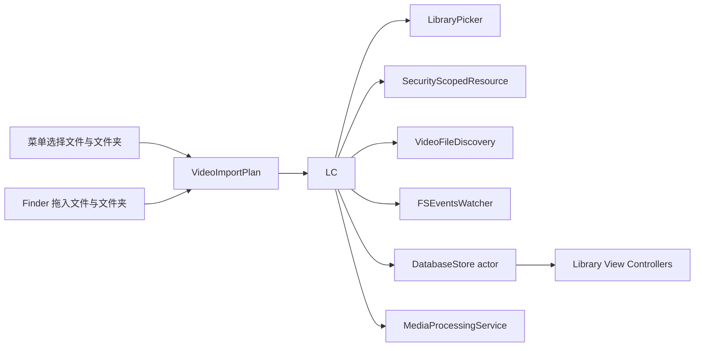
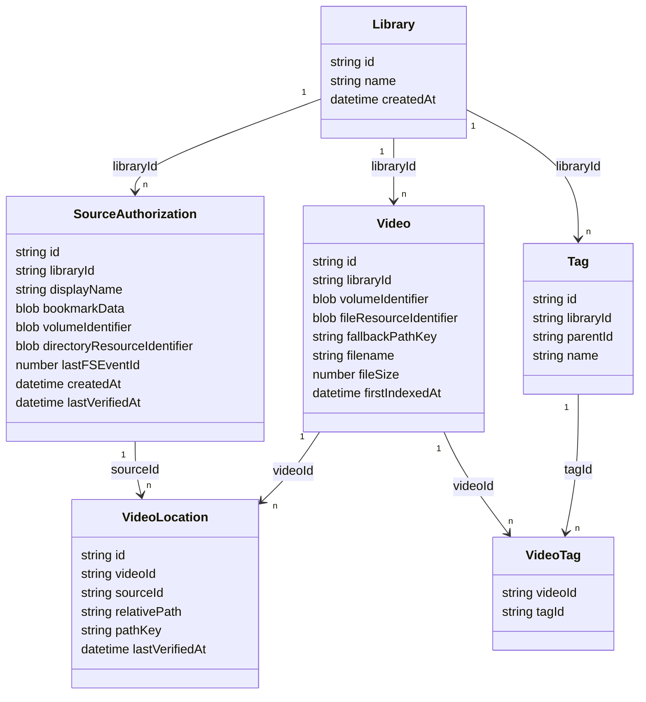

# 手动批量导入视频 Technical Design

状态：已验收（2026-07-18；菜单选择与 Finder 拖入均支持多文件、多文件夹及混合导入）

关联需求：`docs/product/manual-video-import-requirements.md`

## 1. 设计目标

- 将现有单根目录替换模型改为统一视频集合。
- 文件夹承担批量发现、持续访问授权和已有视频状态维护；单独导入的视频使用文件级授权。
- 菜单选择与 Finder 拖入共用统一导入管线。
- 在整个 FileFacet 范围内识别同一个系统文件资源。
- 新视频始终由用户手动导入。
- 已有视频移动时静默更新位置，确认删除时静默移除。
- 所有文件枚举、身份匹配和数据库维护离开主线程。
- 保留现有标签、Finder 标签映射、缩略图和媒体信息。

## 2. 历史实现边界

Schema 4 及更早版本围绕固定 `LibraryRecord.primaryID` 和一个根目录运行：

- `chooseLibrary()` 调用 `replaceLibrary()`，会删除旧根目录及其级联数据。
- Coordinator 只持有一个 Security-Scoped Resource、Bookmark 和 FSEvents Stream。
- `applyScan()` 以完整扫描结果为边界，把未出现的视频标记为 `missing`。
- 视频身份索引包含 `library_id`，路径只保存为当前根目录下的相对路径。
- FSEvents 触发完整扫描，扫描过程中会创建新视频记录。
- Toolbar、菜单和空状态使用“选择资料库”与“重新扫描资料库”语义。

新实现继续保留 `primary` 作为统一标签空间的内部标识，根目录授权从 `libraries` 拆出。用户界面不展示多个资料库。

## 3. 当前 MVP 模块设计

### LibraryAccessCoordinator

- 菜单入口运行 `NSOpenPanel`，Finder 拖入入口读取 Pasteboard；两类入口都接收一个或多个视频、一个或多个文件夹或两者组合。
- 两类入口生成统一导入请求，共用授权、发现、判重、入库、刷新、取消和结果反馈流程。
- 导入批次先按标准化 URL 去重，并由父文件夹覆盖内部文件和子文件夹；跨批次重叠范围继续依靠视频全局身份避免重复记录。
- 按标准化 URL 复用当前进程内已有授权来源，持有对应 Security-Scoped Resource，并按实际监听目录共享 FSEventsWatcher。
- 向界面发送阶段与批次进度，以及新增、已存在、视频失败、无法读取输入项目和已检查文件夹数量。
- 在 MainActor 上协调状态，把文件发现提交给 `.utility` detached task，把数据库工作提交给 DatabaseStore actor。

### SecurityScopedResource

- 每个已连接来源在 App 进程生命周期内持有一个访问对象。
- 对象创建时调用 `startAccessingSecurityScopedResource()`，释放时调用对应的停止访问方法。
- 菜单选择和直接拖入的文件夹保存文件夹级 Bookmark；两种入口中的视频保存文件级 Bookmark。
- 拖放 URL 创建 Bookmark 后立即解析为带安全作用域的 URL，后续发现、媒体读取、监听和恢复均使用解析后的 URL。
- Bookmark 解析为 stale 时由 Coordinator 刷新数据库记录。
- MVP 在单次拖入计划中折叠父子重叠输入，尚未实现跨批次授权折叠、引用计数短租约或来源管理界面。

### VideoFileDiscovery 与 DatabaseStore

- 输入规划识别受支持视频与普通文件夹，排除符号链接、Package 和不受支持文件。
- 直接视频作为单文件发现结果；文件夹使用 `.utility` 优先级递归枚举受支持视频。
- 读取基础文件属性、文件身份和首次 Finder 标签。
- 分批调用数据库导入事务，避免长时间占用数据库 actor。
- 只在首次创建视频记录后进入媒体信息和缩略图队列。
- 已有视频再次发现时只更新位置和基础属性。

### FSEvents 静默维护

- 在 App 进程内以 `.utility` 任务运行，由 LibraryAccessCoordinator 管理生命周期。
- 文件夹来源监听自身目录，文件来源监听其父目录；映射到同一标准化目录的来源共享一个 FSEventsWatcher。
- Watcher 当前只发送“来源发生变化”信号。
- 事件经过约 1 秒防抖后，维护任务枚举所有当前可访问来源并统一协调。
- 只维护已有视频身份、位置和存在状态。
- 新事件会取消上一轮尚未完成的维护任务；手动导入和维护目前没有独立优先级队列。
- App 退出后停止；下次启动为已恢复来源安排一次维护。

### DatabaseStore

- 继续作为 SQLite 单写入协调器并保持 WAL。
- 提供短事务、分批导入、位置重关联和确认删除接口。
- 维护事务返回更新视频 ID 和待删除缩略图 ID；当前界面随后重新查询当前筛选结果和标签。

## 4. 数据模型

### `libraries`

- 继续保留固定 `primary` 记录，表示应用内唯一的统一标签空间。
- Bookmark、扫描时间和 FSEvents 游标的运行时来源迁移到 `source_authorizations`。
- 版本 5 暂时保留 `libraries` 中的旧列及其原值，避免为清理未使用列扩大迁移风险；业务代码停止读取这些列。
- 标签和 Finder 标签映射继续以 `primary` 为作用域，现有标签无需重新归属。

### `source_authorizations`

- 每条记录表示一个内部文件或文件夹授权，不进入用户可见的资料库模型。
- 当前运行时读取 `id`、`library_id`、`display_name`、Bookmark 和创建时间。
- `last_event_id` 与 `health_status` 是后续来源健康和事件续接预留字段；MVP 只把成功保存的来源写为 `available`，不依据这两个字段驱动运行时判断。
- 当前进程内以标准化根 URL 复用完全相同的来源；视频层通过稳定文件身份和路径回退键处理重叠范围判重。

### `videos`

- 保存统一视频身份、媒体信息、缩略图引用和首次入库时间。
- 稳定身份为 `(volume_identifier, file_resource_identifier)`。
- 稳定身份字段建立全局查询索引；数据库写入由单一 actor 串行协调。
- `availability_status` 不再承担长期失效记录筛选；卷离线和权限异常由授权来源状态表达。

### `video_locations`

- 保存视频在某个授权来源下的相对路径。
- 一个视频可以拥有多个位置记录，用于父子目录和重叠授权范围。
- `(source_id, relative_path)` 唯一；稳定身份缺失时使用标准化绝对 URL 的 SHA-256 值作为 `fallback_path_key`，数据库不保存可读的绝对路径。
- `fallback_path_key` 建立全局查询索引，用于不同导入范围之间复用已有视频记录。
- Schema 7 为既有位置增加该回退键；应用恢复授权后按来源根目录和相对路径静默补全旧记录。
- MVP 没有来源删除与授权折叠入口，已有来源及位置记录持续保留。

### `import_runs`

- 记录一次手动导入的来源、开始和结束时间、状态及新增、已存在、失败数量。
- 中断记录只用于诊断和恢复幂等，不决定其他视频的存在状态。
- 历史 `scan_runs` 可以保留为旧迁移数据；新流程不使用其“未出现即失效”规则。

## 5. 全局文件身份

匹配顺序：

1. 文件同时具备卷标识符和文件资源标识符时，查询全局稳定身份。
2. 稳定身份缺失时，查询标准化绝对 URL 的 SHA-256 路径键。
3. 找到视频记录后 Upsert `video_locations`，保留视频 ID、应用标签和 Finder 标签导入状态。
4. 未找到记录时创建视频、位置和首次 Finder 标签关系。
5. 记录后续取得稳定身份时，数据库在事务内补齐身份并合并可能重复的回退记录。

独立复制文件通常具有不同文件资源身份，导入后形成独立视频。符号链接目录继续跳过，避免循环和意外越权。

## 6. 手动导入流程

1. 用户点击“导入视频与文件夹…”并选择视频、文件夹及其组合，或从 Finder 拖入同类内容。
2. 两类入口都将输入分类、去重并折叠父子重叠来源，再生成统一导入请求。
3. LibraryAccessCoordinator 逐项目创建或复用文件级、文件夹级授权来源并持有访问对象。
4. VideoFileDiscovery 在 `.utility` detached task 中读取直接视频，或递归发现文件夹中的受支持视频。
5. 每批视频按全局身份分为新增、已存在和视频失败；单个输入项目授权、发现或入库失败时记录输入失败并继续其余项目。
6. 新增视频执行一次 Finder 标签导入，并进入媒体信息与缩略图队列。
7. 已存在视频只补充或更新位置及基础文件属性；本次没有发现的既有视频保持原状。
8. 完成后显示轻量结果反馈；空文件夹显示已检查数量，取消或失败不会回滚已经完整提交的批次。

批量大小先采用 100 条，并通过性能验证调整。每批事务提交后主动让出执行权，使标签编辑和筛选查询能够及时进入数据库 actor。

## 7. 静默状态维护

### FSEvents 输入

`FSEventsWatcher` 当前按标准化监听目录创建 Stream，并由映射到同一目录的来源共享；文件来源映射到父目录，文件夹来源映射到自身目录。Watcher 只向 Coordinator 返回变化信号，事件路径、flags 和事件 ID 没有进入运行时状态。

- 事件先进行约 1 秒防抖。
- 每次维护枚举全部当前可访问授权范围，并只把发现结果与数据库已有身份匹配。
- 匹配成功时更新位置和基础属性，未知身份直接忽略。
- 任一来源枚举失败或出现单文件发现失败时，本轮保留无位置视频，不执行最终删除。

### 移动与重命名

- 一次维护先收集全部可访问来源，再分批更新位置，最后统一清理无位置视频，避免来源完成顺序造成误删。
- 在任一可访问授权范围内找到相同稳定身份后，更新 `video_locations` 和展示文件名。
- 保留视频 ID、标签、首次入库时间和 Finder 标签导入状态。
- 文件内容修改时只把该视频的媒体信息和缩略图状态置为待处理。

### 确认删除

删除视频记录前必须同时满足：

1. 相关来源已经恢复 Bookmark 并取得访问权。
2. 本轮全部当前可访问来源完成枚举，且没有单文件发现失败。
3. 防抖后的统一协调没有在任何来源中找到该视频身份。
4. 数据库清理位置后确认该视频不再拥有任何位置。

确认后在一个事务中删除 `videos`，由外键级联删除 `video_locations` 和 `video_tags`。事务返回缩略图 ID，缓存文件在提交后异步清理；清理失败由后续孤儿缓存维护处理。

### 无法确认的情况

- 外置卷离线、Bookmark 失效或权限不足时保持数据库记录。
- 文件移到所有授权范围以外时，应用无法继续确认其位置；来源健康并完成协调后，该视频按离开管理范围移除。
- 用户以后手动导入该文件时创建新记录，并重新执行首次 Finder 标签导入。

## 8. 并发与界面响应

- `NSOpenPanel` 和 AppKit 状态更新运行在 MainActor。
- 拖动序列在 MainActor 上读取 Pasteboard 并缓存输入规划，避免 `draggingUpdated` 重复读取文件属性。
- 递归枚举、视频身份与 Finder 标签读取运行在 `.utility` detached task，协调状态运行在 MainActor。
- DatabaseStore 内只执行短查询和短事务，不在 actor 中进行目录枚举或 AVFoundation 处理。
- SQLite 保持 WAL；维护写入按小批次提交并在批次间让出执行权。
- 导入任务和维护任务分别可取消；当前没有显式的同来源暂停队列。
- 网格滚动和选择不等待维护结果；数据库差异完成后再合并到当前快照。
- 维护流程不显示进度、弹窗或通知。

MVP 使用 App 进程内后台服务。XPC Service 留给需要退出后持续运行、故障隔离或性能数据证明进程拆分有价值的后续版本。

## 9. 文件访问

- 每次文件操作通过 `video_locations` 找到当前可用来源和相对路径；文件级来源使用空相对路径解析为来源文件本身。
- LibraryAccessCoordinator 使用当前进程内持有的 Security-Scoped Resource 解析视频 URL。
- 多个位置都可用时使用数据库位置查询中首个可解析位置；MVP 没有按层级或最近验证时间排序的选择策略。
- Bookmark 变旧时静默刷新数据库记录。
- 任何日志都不输出 Bookmark、完整路径、文件名或 Finder 标签内容。

## 10. 用户界面与交互

### 原型设计规范

- Purpose Statement：让用户通过菜单或 Finder 拖入从多个位置持续扩充统一视频集合，同时清楚区分手动导入和后台静默维护。原型重点验证导入入口、过程反馈、重复导入结果和取消后的状态连续性。
- Aesthetic Direction：Industrial / utilitarian，延续已接受的 Xcode 式 macOS 原生三栏布局，强调高信息密度、系统层级和低干扰反馈。
- Color Palette：使用 macOS 语义色；HTML 原型以 `#F5F5F5` 窗口背景、`#E8E8E8` 侧边栏、`#FFFFFF` 内容区、`#0A84FF` 系统强调色、`#6E6E73` 次要文字作为浅色模式参考，并提供对应深色模式。
- Typography：正式应用使用 SF Pro / macOS 系统字体。这里覆盖通用 UI 技能对系统字体的限制，原因是产品已经明确要求遵循 macOS 原生规范；HTML 原型使用本机可用的系统字体模拟最终 AppKit 排版。
- Layout Strategy：保持 Xcode 风格 Sidebar、内容区和 Inspector 的非居中三栏结构；导入状态进入内容区 Toolbar 下方的就地反馈区域，避免居中卡片和覆盖式流程。
- Icons：正式应用使用 SF Symbols；HTML 原型使用同一套线性 SVG 图标近似表达，不使用 Emoji。

- “文件”菜单提供“导入视频与文件夹…”，快捷键使用 `⇧⌘I`，选择器支持多选视频、文件夹及两者组合。
- Toolbar 不放置导入按钮，保留浏览、搜索、缩略图尺寸和窗格控制。
- 移除“重新扫描资料库”；用户再次执行导入即可增量发现该文件夹中的新视频。
- 空状态说明从菜单栏选择“文件 > 导入视频与文件夹…”、使用 `⇧⌘I` 或直接拖入视频与文件夹，窗口内不放置导入按钮。
- 用户可将多个视频、多个文件夹或两者组合拖入中部区域；拖动期间保持网格原样，只使用系统复制或禁止指针反馈。
- 导入期间显示可取消的轻量阶段与批次进度，不阻塞已有视频浏览和标签操作。
- 导入结束分别显示新增、已存在、视频失败和无法读取的输入项目；没有发现视频时显示已检查文件夹数量。正常状态维护不提供可见进度。
- 文件确认删除后直接从当前网格消失；移动成功后保持选择并更新路径。
- “无法访问”筛选从侧边栏移除。

HTML 原型已覆盖空资料库、多视频、多文件夹、混合输入、空文件夹、导入中、分类结果、重复导入和取消状态，并已取得用户确认。正式 AppKit 实现已获提交授权；真实 Finder 路径仍按发布前验收清单执行。

## 11. 数据迁移

当前数据库版本为 Schema 7。迁移按版本顺序在事务中完成：

### Schema 4 → 5：多来源手动导入

1. 创建 `source_authorizations`、`video_locations` 和 `import_runs`。
2. 将现有 `libraries.primary.root_bookmark_data` 复制到一个来源授权，旧列暂时保留并停止业务读取。
3. 为现有视频按原相对路径创建位置记录，保留视频 ID 和全部 `video_tags`。
4. 重建 `videos`，建立全局稳定身份和回退身份条件唯一索引。
5. 保留媒体信息、缩略图引用、首次入库时间和 Finder 标签导入时间。
6. 保留 `tags` 与 `finder_tag_import_mappings` 的 `primary` 作用域。
7. 执行 `PRAGMA foreign_key_check` 和身份冲突检查后提交。

旧 Bookmark 无法解析时保留数据库记录并跳过该来源的运行时连接。MVP 尚未提供来源重新授权界面。

### Schema 5 → 6：Finder 导入标签顶级平铺

1. 移除旧“Finder 标签”展示根节点。
2. 将其子标签迁移为顶级标签。
3. 顶级同名时合并视频关系、子标签和 Finder 映射。

### Schema 6 → 7：路径回退身份

1. 为 `video_locations` 增加 `fallback_path_key`。
2. 建立回退键查询索引。
3. 应用恢复来源后按根 URL 和相对路径静默补全既有位置的回退键。

## 12. 失败处理

- 单个视频发现失败进入视频失败计数，其他视频继续。
- 单个文件或文件夹无法授权、读取或入库时进入输入项目失败计数，其他项目继续。
- 整批输入均无法取得持续访问权限时显示整批失败；文件夹没有受支持视频时显示未发现视频及已检查文件夹数量。
- 文件夹授权或枚举失败不修改既有视频。
- 导入取消保留已提交批次，再次导入保持幂等。
- 身份冲突在事务内合并位置与标签关系，保留更早的 `first_indexed_at` 和已完成媒体信息。
- 单个版本迁移失败时回滚该版本，保留上一个已完成版本的数据用于再次迁移。
- 维护任务失败只记录隐私安全的错误类别，下次事件或启动时重试。

## 13. 验证策略

### 自动化

自动化只针对已经通过用户验收的高频主路径、核心状态转换和数据完整性风险补充；当前新增拖入行为等待正式 App 验收后再确定覆盖范围。

- Schema 4 到 5 迁移保留视频、标签、Finder 映射和缩略图引用。
- Schema 5 到 6 平铺 Finder 导入标签并保留视频关系和映射。
- Schema 6 到 7 增加路径回退键，并在来源恢复后补全旧位置。
- A、B 多次导入后全局视频数量和标签关系正确。
- 父子目录与重叠目录发现同一稳定身份时只创建一个视频。
- 已有视频再次导入时不重复同步 Finder 标签。
- 单次导入未覆盖其他视频时不删除其他记录。
- 移动事件匹配身份后保留视频 ID 和标签并更新位置。
- 来源健康且卷在线时确认删除会级联清理关系。
- 离线卷、权限失败和事件丢失不会触发删除。
- 未知新文件事件不会创建视频。
- 维护批次可以取消，并且不会破坏已提交数据。

### 工程与手动验收

- 默认执行 Debug build；仅在用户明确要求时运行测试套件或 App。
- 使用真实多视频、多文件夹、混合输入、空文件夹、父子重叠目录、外置卷和 Finder 标签样本验收。
- 核对拖动指针、阶段与批次进度、部分失败继续处理、分类结果和重启后文件与文件夹 Bookmark 恢复。
- 在大量视频和持续滚动时验证导入、移动、删除和 UI 响应。
- 验证 App 关闭期间发生的移动和删除能够在下次启动后静默协调。
- HTML 原型已经用户确认；最终窗口行为仍由用户手动验收。

## 14. 已知边界

- FSEvents 提供变化线索，最终状态由文件身份和可访问范围校验确定。
- 跨卷移动通常产生新的系统文件资源身份，后续手动导入时作为独立视频处理。
- 缺少稳定文件资源身份的视频发生移动时无法可靠保持原记录；路径回退只保证同一路径重复导入的幂等性。
- 移出全部授权范围的文件无法被应用定位，将离开当前资料库。
- 系统资源竞争仍可能产生少量磁盘和数据库等待；所有用户操作均不执行同步文件扫描，界面保持可交互。
